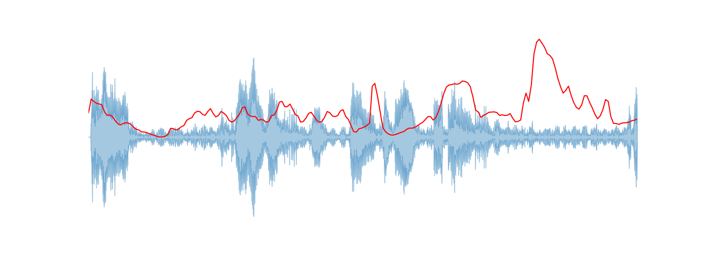

# PyMAiVAR -  An open-source python suit for audio-image representation for human action recognition

## Abstract

We present PyMAiVAR which is a toolbox preferable for generating audio-image representations that incorporates for human actions information. The Spectral Centroid feature, which is widely used for music genre identification and audio classification, inspired our feature methodology. The representation’s performance is evaluated for multimodal human action recognition and is comparable to other representations and other unimodal approaches on the same dataset. We also present few other use case of the toolbox for generating image-based representations.  PyMAiVAR can be a valuable tool for researchers in the field of multimodal action recognition, providing enhanced performance by leveraging multiple modalities. The package is implemented in Python and can be used across different operating systems. 

## Compilation requirements, operating environments, and dependencies

	ffmpeg, librosa, matplotlib, numpy, sklearn
	python 3.8

## Modules

	core: Core funtionality of pymaivar
	example: Example usage of PyMAiVAR
	myutils: Utility functions for PyMAiVAR

## Documentation

	Documentation for each module is in their respective .md files

	core --> core.md
	example --> example.md
	myutils --> myutils.md

> An example can be found in **example.py**

## Live Demo
	

## Sample Outputs
  
  
  
  
  
  
  

## Cite the following reference if you use the code implementation

	@INPROCEEDINGS{pymaivar2022shaikh,
  		author={Shaikh, Muhammad Bilal and Chai, Douglas and Islam, Syed Mohammed Shamsul and Akhtar, Naveed},
  		booktitle={2022 IEEE International Conference on Visual Communications and Image Processing (VCIP)}, 
  		title={MAiVAR: Multimodal Audio-Image and Video Action Recognizer}, 
  		year={2022},
  		pages={1-5},
  		doi={10.1109/VCIP56404.2022.10008833}}

## Acknowledgements
This research is jointly supported by Edith Cowan University (ECU) and Higher Education Commission (HEC) of Pakistan under Project #PM/HRDI-UESTPs/UETs-I/Phase-1/Batch-VI/2018. Dr. Akhtar is a recipient of Office of National Intelligence National Intelligence Postdoctoral Grant # NIPG-2021–001 funded by the Australian Government.

